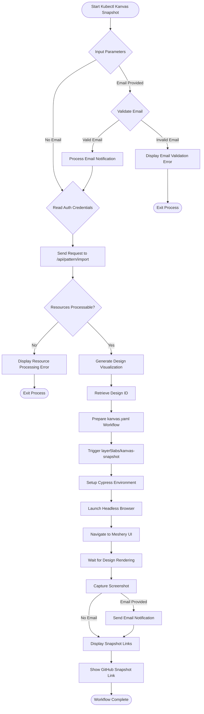

# Kubectl Kanvas Snapshot Implementation

This document outlines the implementation details and workflow for the Kubectl Kanvas Snapshot plugin.

## Overview

Kubectl Kanvas Snapshot is a Kubectl plugin that creates visual snapshots of Kubernetes resources using Meshery's visualization capabilities. It transforms Kubernetes manifests into interactive designs that can be viewed, shared, and analyzed.

## Workflow Diagram

The following diagram illustrates the end-to-end workflow of the plugin:

## Implementation Details

The workflow consists of the following key steps:

1. **Input Processing**:
   - Parse Kubernetes manifest files
   - Validate email if provided
   - Check authentication credentials

2. **Meshery Integration**:
   - Send base64-encoded manifest to Meshery's API
   - Process the response to extract the design ID

3. **GitHub Workflow**:
   - Trigger the GitHub Actions workflow in the layer5labs/kanvas-snapshot repository
   - Pass design ID and other parameters

4. **Snapshot Generation**:
   - Cypress browser automation captures screenshots of the design
   - Screenshots are stored as artifacts in the GitHub workflow run

5. **Result Communication**:
   - Display links to view the design in Meshery
   - Show where to find the generated screenshots
   - Send email notification if an email was provided

